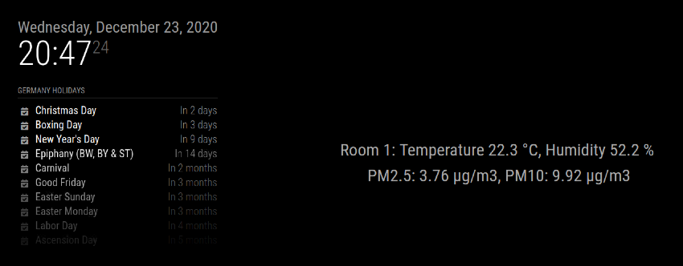

# MMM-01ZM

Since I got a couple of Xiaomi LYWSDCGQ 01ZM Temperature-Humidity AND Nova PM SDS011 sensors and I want to display the values on the MMM [MagicMirror2](https://magicmirror.builders/) 
without using the Gateway approach, I created this MMM-01ZM module.



## Installation of 01ZM Temp&Humidity Sensor

In */home/pi/MagicMirror/modules* create a new folder MMM-01ZM with `git clone https://github.com/rubinho101/MMM-01ZM`\

### Easy installation

Go to the */modules/MMM-01ZM* folder `cd /home/pi/MagicMirror/modules/MMM-01ZM`.\
Make the postinstaller.sh executable `chmod +x /home/pi/MMM-01ZM/img/postinstaller.sh`.\
In the */modules/MMM-01ZM* folder `npm install` to install the dependencies and libraries.

### Manual installation of dependencies and libraries

This module requires the [mitemp_bt](https://github.com/hassiweb/mitemp) library.\
Go to the */modules/MMM-01ZM* folder `cd /home/pi/MagicMirror/modules/MMM-01ZM`\
`pip3 install bluepy`\
`pip3 install btlewrap`\
`git clone https://github.com/hassiweb/mitemp`\
Move the *parseBLE01ZM.py* file into the */MMM-01ZM/mitemp* folder.\
In */home/pi/MagicMirror/modules/MMM-01ZM/mitemp/mitemp_bt/mitemp_bt_poller.py* line 34 change the second argument `self._bt_interface = BluetoothInterface(backend, adapter)` to `self._bt_interface = BluetoothInterface(backend, adapter=adapter)`.

In addition, *parseBLE01ZM.py* needs [Sanic](https://sanic.readthedocs.io/en/latest/) the Python3 web server framework to interact with MMM:\
`pip3 install sanic`

The node_helper.js requires [get-json](https://www.npmjs.com/package/get-json) library:\
`npm install get-json`

### Final steps

Next, add the MAC addresses of your sensors to the node_helper.js array:\
`const rooms = ["your sensor mac", "your sensor mac", "your sensor mac"]`

Finally, add MMM-01ZM to the *config.js* file:
```
		{
			module: "MMM-01ZM",
			position: "upper_third"
		},
```

Before you start MMM run *parseBLE01ZM.py* in *MMM-01ZM/mitemp*.

Please be aware of the setInterval and setTimeout values in the *MMM-01ZM.js* and *node_helper.js* files.
This needs to be balanced based on the number of sensors you parse to avoid sending too many requests to the Raspi BLE component.

Hint: It takes about 45 seconds for the first two sensors to be displayed.


### Installation of Nova PM Sensor SDS011

Note: Only valid for Nova PM Sensor SDS011 to display Air Quality.

Move *airquality.py* into the *./mitemp* folder\
Go to the */modules/MMM-01ZM/mitemp* folder `cd /home/pi/MagicMirror/modules/MMM-01ZM/mitemp`\
Get *sds011.py* into *mitemp* folder `git clone https://github.com/ikalchev/py-sds011/blob/master/sds011/__init__.py` and rename the file to sds011.py\
Uncomment the `@app.route('/pmdata')` and `following async def get_pm()` function in *parseBLE01ZM.py*

Hint: The SDS011 air quality sensor data is being corrected by `pmCor(Humidity)` if the humidty is > 38 in *MMM-01ZM.js*. 
The parameter k, which is the degree of hygroscopicity of a particle, is set to 0.5.


